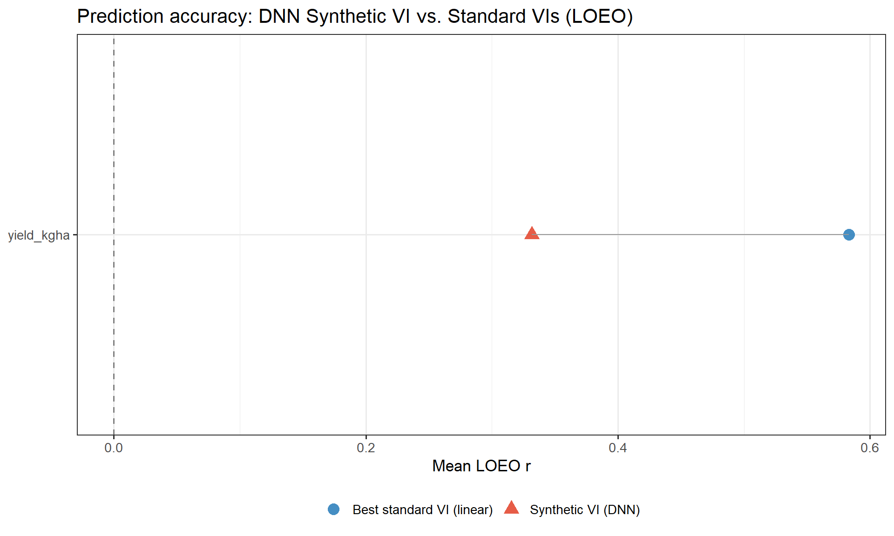
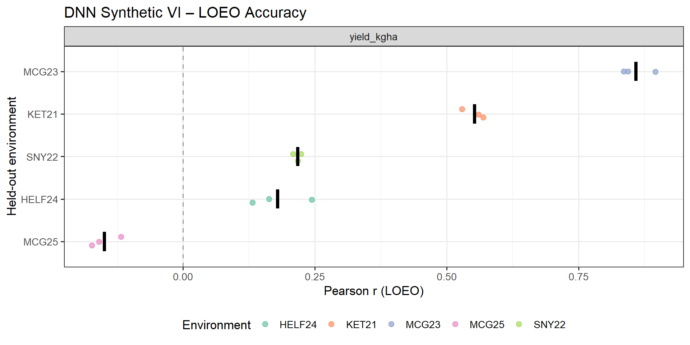
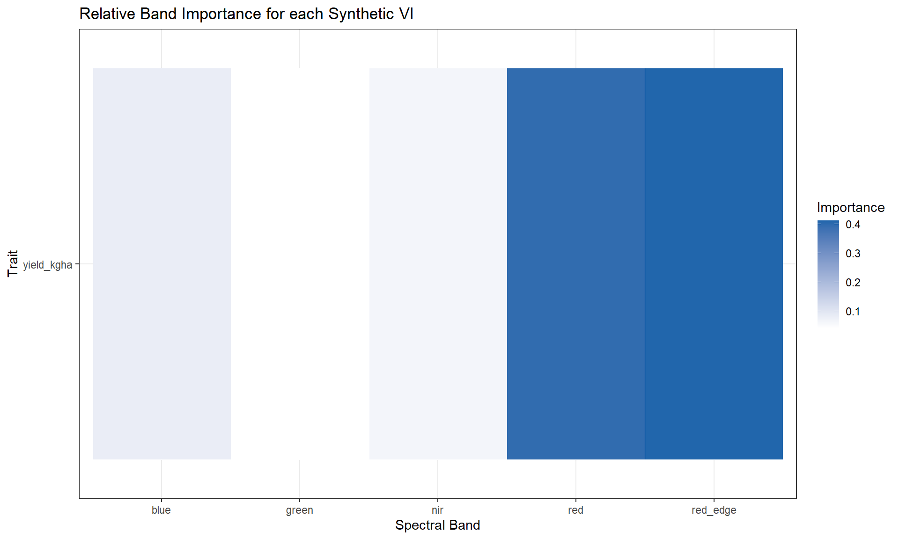

# DNN-Derived Synthetic Vegetation Index for Phenotype Prediction

[](LICENSE)
[](https://www.r-project.org/)
[](https://torch.mlverse.org/)
[](https://sss9010.github.io/dnn-synthetic-vi/DNN_Synthetic_VI.html)

A deep neural network with a **spectral bottleneck architecture** learns a data-optimised vegetation index directly from raw multispectral drone bands — replacing hand-crafted indices like NDVI with a trait-specific scalar that maximises predictive accuracy for agronomic and malt quality traits in winter barley.

📄 **[Read the full rendered report](https://sss9010.github.io/dnn-synthetic-vi/DNN_Synthetic_VI.html)**

---

TLDR: 
Standard vegetation indices (NDVI, NDRE, …) use fixed, hand-crafted band ratios.
This analysis asks: **what if the network learns the optimal band combination instead?**

A DNN with a single-neuron bottleneck is trained end-to-end on five raw spectral
bands (blue, green, red, red-edge, NIR) to predict a target trait. The bottleneck
forces all spectral information through one scalar — the *Synthetic VI* — before
the prediction head. That scalar is the learned index, and its formula is fully
extractable from the encoder weights.

---

## Key Results

<p align="center">
  
  <br><em>DNN Synthetic VI vs. best standard VI — leave-one-environment-out Pearson r</em>
</p>

<p align="center">
  
  <br><em>Leave-One-Environment-Out accuracy per held-out trial site (dots = training reps)</em>
</p>

<p align="center">
  
  <br><em>Gradient-based band importance — which spectral channels drive each Synthetic VI</em>
</p>

---

## DNN Architecture

```
Band Encoder      5 bands → FC(16) → ReLU → dropout
                                  → FC(8)  → ReLU → dropout
                                  → FC(1)           ← Synthetic VI (no activation)
                                       ↓
Prediction Head   [SynVI ‖ env_embed(4)] → FC(8) → ReLU → FC(1) → trait
```

- **Bottleneck** — a single linear output neuron forces all spectral information
  through one scalar, mirroring the structure of NDVI while learning non-linear,
  data-optimal band combinations.
- **Environment embedding** — a learned 4-d vector per trial shifts the VI→trait
  mapping for each environment, so the shared encoder generalises across sites.
- **LOEO inference** — for unseen environments, the mean embedding of the four
  training environments is used as a proxy (no fine-tuning required).

---

## Cross-Validation Schemes

| Scheme | Description |
|--------|-------------|
| **LOEO** (Leave-One-Environment-Out) | Train on 4 trial sites, predict the held-out 5th. Measures cross-environment generalisation. |
| **Within-env 5-fold by GID** | 5-fold CV within each environment, splits by genotype ID. Measures within-trial predictive ability for unseen lines. |
| **Adapt B — freeze encoder, fine-tune head** | Pre-train on 4 envs; freeze encoder; fine-tune prediction head + embedding on adaptation GIDs. |
| **Adapt C — SynVI + linear** | Pre-train on 4 envs; freeze encoder; fit OLS (trait ~ SynVI) on adaptation GIDs. No further neural network training. |

All schemes use **3 random-seed repetitions**. NDVI linear regression runs under
the same designs as a baseline. Splits are always by GID to prevent data leakage.

---

## Repository Structure

```
dnn_synthetic_vi/
├── analysis/
│   ├── DNN_Synthetic_VI.Rmd        # Main analysis — render this
│   └── DNN_Synthetic_VI_cache/     # knitr cache for heavy training chunks
├── data/
│   └── WMB_pheno.Rdata             # Input: merged spectral + phenotype table
├── docs/
│   ├── DNN_Synthetic_VI.html       # Pre-rendered HTML report
│   └── figure/DNN_Synthetic_VI.Rmd/  # All generated figures (PNG)
└── scripts/
    ├── ndvi_corr.R                 # NDVI–yield Pearson r per environment
    └── variance_partition.R        # Between- vs within-env variance decomposition
```

---

## Data

`data/WMB_pheno.Rdata` — a single R data frame containing:

| Column group | Contents |
|---|---|
| Spectral bands | `blue`, `green`, `red`, `red_edge`, `nir` (UAV reflectance per plot) |
| Standard VIs | NDVI, NDRE, EVI, GNDVI, SAVI, and more |
| Target trait | Yield and associated agronomic measurements (column 19) |
| Metadata | `GID` (genotype), `Env` (trial site), `Timepoint` |

**Five Env × Timepoint groups** are used — one optimal flight per trial year:
`HELF24_TP7`, `KET21_TP4`, `MCG23_TP5`, `MCG25_TP12`, `SNY22_TP6`


---

## Requirements

```r
install.packages(c(
  "tidyverse", "ggplot2", "patchwork",
  "corrplot", "knitr", "kableExtra",
  "torch"
))
torch::install_torch()   # one-time LibTorch download (~0.5 GB)
```

---

## Rendering the Report

Open R from the **project root** and run:

```r
rmarkdown::render("analysis/DNN_Synthetic_VI.Rmd",
                  output_dir = "docs",
                  output_file = "DNN_Synthetic_VI.html")
```

The knitr cache skips the two heavy training chunks (`run-training`,
`run-adaptation-cv`) if the code is unchanged. Delete
`analysis/DNN_Synthetic_VI_cache/` to force a full re-run.

---

## Helper Scripts

```r
source("scripts/ndvi_corr.R")          # NDVI–yield Pearson r per environment
source("scripts/variance_partition.R") # eta² variance decomposition
```

---

## Citation

```
Sepp, S.S., Jannink, JL., Sorrells, M.E. (2025). DNN-Derived Synthetic Vegetation Index for Phenotype Prediction.
GitHub. https://github.com/sss9010/dnn-synthetic-vi
```

A machine-readable citation is in [`CITATION.cff`](CITATION.cff).

---

## Part of a larger project

This repository is a self-contained extract from the full NY Winter Malting Barley
prediction pipeline:  
🔗 **[sss9010/Predicting_WMB_for_NY](https://github.com/sss9010/Predicting_WMB_for_NY)**

---

## Contact

**Siim Sepp** — sss322@cornell.edu  

