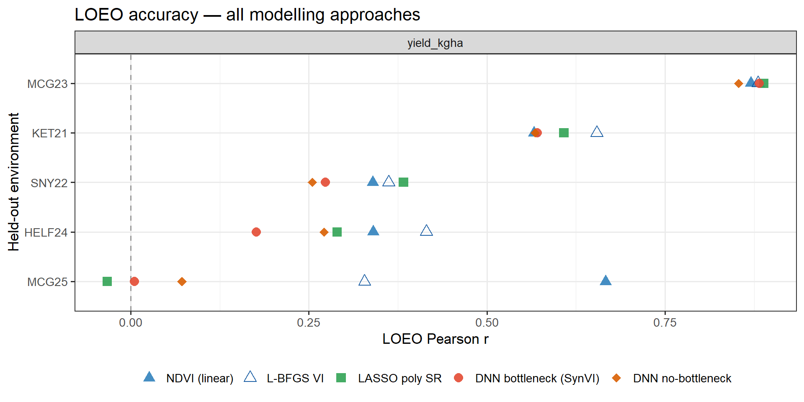
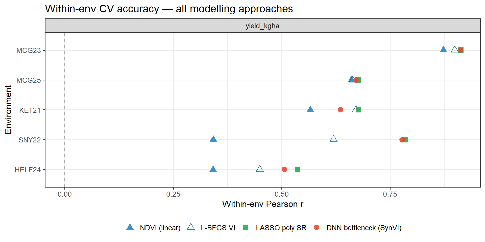
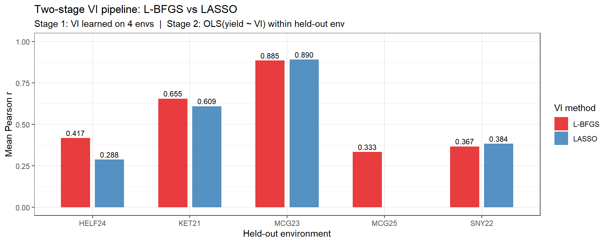

# Comparing Spectral VI Derivation Approaches for Barley Yield Prediction

[](LICENSE)
[](https://www.r-project.org/)
[](https://torch.mlverse.org/)
[](https://sss9010.github.io/dnn-synthetic-vi/DNN_Synthetic_VI.html)

Three approaches for deriving spectral vegetation indices from UAV multispectral imagery are compared for predicting barley grain yield across five field environments — benchmarked under leave-one-environment-out (LOEO) and within-environment cross-validation designs.

📄 **[Read the full rendered report](https://sss9010.github.io/dnn-synthetic-vi/DNN_Synthetic_VI.html)**

---

**TLDR:**
Standard indices (NDVI, NDRE, …) use fixed, hand-crafted band ratios. This analysis
asks: can learning the band combination from data improve cross-environment and within-environment prediction?

Three approaches are evaluated using five raw spectral bands (blue, green, red,
red-edge, NIR):

1. **L-BFGS-optimised VI** — retains the interpretable normalised-ratio structure of
   NDVI but learns band weights that directly maximise Pearson *r* with yield.
2. **Symbolic regression** — LASSO polynomial SR and PySR search for compact
   mathematical expressions without constraining the formula structure.
3. **DNN bottleneck (Synthetic VI)** — a neural network with a single-neuron
   bottleneck learns a non-linear, data-optimised index end-to-end.

**Key findings:**
- **Cross-environment (LOEO):** L-BFGS-VI (mean *r* = 0.53) is the best-performing learned method and closely matches NDVI. LASSO and DNN degrade on out-of-distribution environments — particularly MCG25, a late-season flight with an inverted spectral–yield relationship that breaks purely data-driven approaches.
- **Within-environment:** LASSO (*r* = 0.72) and DNN (*r* = 0.70) both outperform NDVI (*r* ≈ 0.56) and L-BFGS (*r* = 0.66), showing that more expressive models capture genotypic yield variation more effectively when environmental context is held constant.
- **Deployment:** A two-stage L-BFGS pipeline — formula learned from N−1 environments, calibrated with OLS on check plots in the target environment — provides a portable, interpretable VI that matches NDVI cross-environment performance with no neural network inference at deployment.

---

## Key Results

<p align="center">
  
  <br><em>LOEO mean Pearson r — all models. L-BFGS-VI leads cross-environment generalisation.</em>
</p>

<p align="center">
  
  <br><em>Within-environment 5-fold CV — LASSO and DNN outperform NDVI and L-BFGS within environments.</em>
</p>

<p align="center">
  
  <br><em>Two-stage deployment pipeline: VI learned from N−1 environments, calibrated with OLS in the target environment.</em>
</p>

---

## Approaches

### Approach 1 — L-BFGS Coefficient Optimisation

The normalised-ratio structure of NDVI is preserved but all five bands enter
both numerator and denominator with learnable weights, optimised by L-BFGS to
directly maximise Pearson *r* on training data:

$$\text{VI}_{\text{LBFGS}} = \frac{\mathbf{w}_{\text{num}}^\top \mathbf{x}}{\exp(\mathbf{w}_{\text{den}})^\top \mathbf{x} + \varepsilon}$$

Coefficients are initialised at the NDVI solution; OLS then calibrates the linear scale.

### Approach 2 — Symbolic Regression

- **LASSO polynomial SR** — degree-2 polynomial features (20 terms: linear + squared + pairwise)
  with LASSO regularisation; fixed structure, learned sparse coefficients.
- **PySR** — evolutionary search over expression trees; discovers both formula
  structure and coefficients without constraints (requires Python + PySR).

### Approach 3 — DNN Bottleneck (Synthetic VI)

```
Band Encoder      5 bands → FC(16) → ReLU → dropout
                                  → FC(8)  → ReLU → dropout
                                  → FC(1)           ← Synthetic VI (linear)
                                       ↓
Prediction Head   [SynVI ‖ env_embed(4)] → FC(8) → ReLU → FC(1) → trait
```

- **Bottleneck** — single linear neuron forces all spectral information through
  one scalar, mirroring NDVI structure while allowing non-linear band combinations.
- **Environment embedding** — learned 4-d vector per trial shifts the VI→trait
  mapping so the shared encoder can generalise across sites.
- **LOEO inference** — mean embedding of the four training environments is used
  as a proxy for unseen environments.

### Two-Stage Deployment Pipeline

A deployment-oriented evaluation that cleanly separates VI learning from calibration:

- **Stage 1** — VI formula learned from N−1 training environments (L-BFGS or LASSO)
- **Stage 2** — OLS `yield ~ VI` fit on check plots in the target environment; predict remaining genotypes

The L-BFGS variant produces a portable five-band formula (no neural network inference needed) that can be applied in any GIS or raster calculator and calibrated with a minimal set of check plots.

---

## Cross-Validation Schemes

| Scheme | Description |
|--------|-------------|
| **LOEO** (Leave-One-Environment-Out) | Train on 4 trial sites, predict the held-out 5th. Measures cross-environment generalisation. |
| **Within-env 5-fold by GID** | 5-fold CV within each environment, splits by genotype ID. Measures within-trial predictive ability for unseen lines. |
| **Two-stage LOEO** | VI learned on 4 environments; OLS calibration by GID fold within held-out environment. |

All schemes use **3 random-seed repetitions**. NDVI linear regression runs under
the same designs as a baseline. Splits are always by GID to prevent data leakage.
Bands are z-scored per environment; NDVI and yield are also z-scored per environment
for the baseline regression.

---

## Repository Structure

```
dnn_synthetic_vi/
├── analysis/
│   ├── DNN_Synthetic_VI.Rmd          # Main analysis — render this
│   ├── two_stage_vi_pipeline.R       # Standalone two-stage VI pipeline (A, B, D)
│   ├── quick_model_comparison.R      # Fast LOEO preview (150 epochs, 1 rep)
│   └── DNN_Synthetic_VI_cache/       # knitr cache for heavy training chunks
├── data/
│   ├── WMB_pheno.Rdata               # Input: merged spectral + phenotype table
│   └── model_results.Rdata           # Pre-saved CV results (load to skip retraining)
├── docs/
│   └── DNN_Synthetic_VI.html         # Pre-rendered HTML report
└── scripts/
    ├── ndvi_corr.R                   # NDVI–yield Pearson r per environment
    ├── variance_partition.R          # Between- vs within-env variance decomposition
    └── save_model_results.R          # Extract CV results from knitr cache → .Rdata
```

---

## Data

`data/WMB_pheno.Rdata` — a single R data frame containing:

| Column group | Contents |
|---|---|
| Spectral bands | `blue`, `green`, `red`, `red_edge`, `nir` (UAV reflectance per plot) |
| Standard VIs | NDVI, NDRE, EVI, GNDVI, SAVI, and more |
| Target trait | Yield and associated agronomic measurements (column 19) |
| Metadata | `GID` (genotype), `Env` (trial site), `Timepoint` |

**Five Env × Timepoint groups** are used — one optimal flight per trial year:
`HELF24_TP7`, `KET21_TP4`, `MCG23_TP5`, `MCG25_TP12`, `SNY22_TP6`

Preprocessing: per-environment NDVI outlier removal (median ± 2.5 × MAD), per-environment band z-scoring.

---

## Requirements

```r
install.packages(c(
  "tidyverse", "ggplot2", "patchwork",
  "corrplot", "knitr", "kableExtra",
  "torch", "glmnet", "reticulate"
))
torch::install_torch()          # one-time LibTorch download (~0.5 GB)
# reticulate::py_install("pysr") # optional — needed for PySR only
```

---

## Rendering the Report

### Fast re-render (plots only, no retraining)

`data/model_results.Rdata` contains all pre-saved CV results. When this file
exists, all training chunks are automatically skipped and the report renders in
minutes:

```r
rmarkdown::render("analysis/DNN_Synthetic_VI.Rmd",
                  output_dir = "docs",
                  output_file = "DNN_Synthetic_VI.html")
```

### Full re-run from scratch

Delete the saved results file to force retraining (~hours on CPU):

```r
file.remove("data/model_results.Rdata")
rmarkdown::render("analysis/DNN_Synthetic_VI.Rmd",
                  output_dir = "docs",
                  output_file = "DNN_Synthetic_VI.html")
```

After a full re-run, update the saved results with:

```r
source("scripts/save_model_results.R")
```

---

## Helper Scripts

```r
source("scripts/ndvi_corr.R")               # NDVI–yield Pearson r per environment
source("scripts/variance_partition.R")      # eta² variance decomposition
source("scripts/save_model_results.R")      # extract CV results from cache → data/model_results.Rdata
source("analysis/quick_model_comparison.R") # fast LOEO preview (150 epochs, 1 rep)
source("analysis/two_stage_vi_pipeline.R")  # standalone two-stage pipeline (A, B, D)
```

---

## Citation

```
Sepp, S.S., Jannink, JL., Sorrells, M.E. (2025). Comparing Spectral VI Derivation Approaches for Barley Yield Prediction.
GitHub. https://github.com/sss9010/dnn-synthetic-vi
```

A machine-readable citation is in [`CITATION.cff`](CITATION.cff).

---

## Part of a larger project

This repository is a self-contained extract from the full NY Winter Malting Barley
prediction pipeline:  
🔗 **[sss9010/Predicting_WMB_for_NY](https://github.com/sss9010/Predicting_WMB_for_NY)**

---

## Contact

**Siim Sepp** — sss322@cornell.edu  
