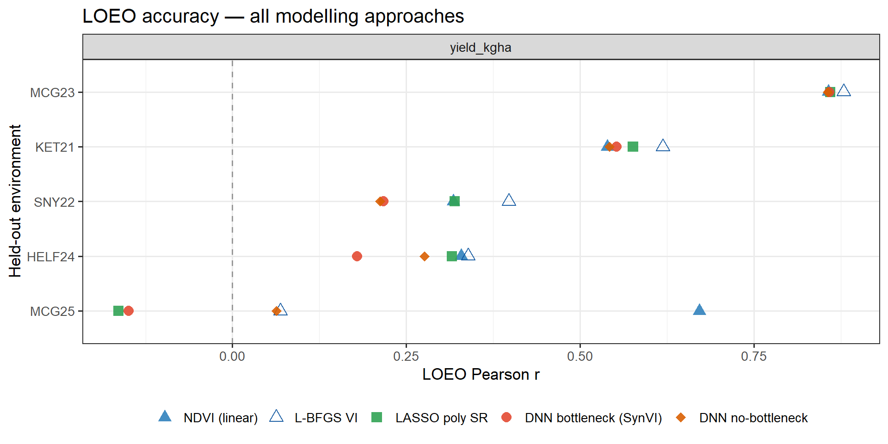
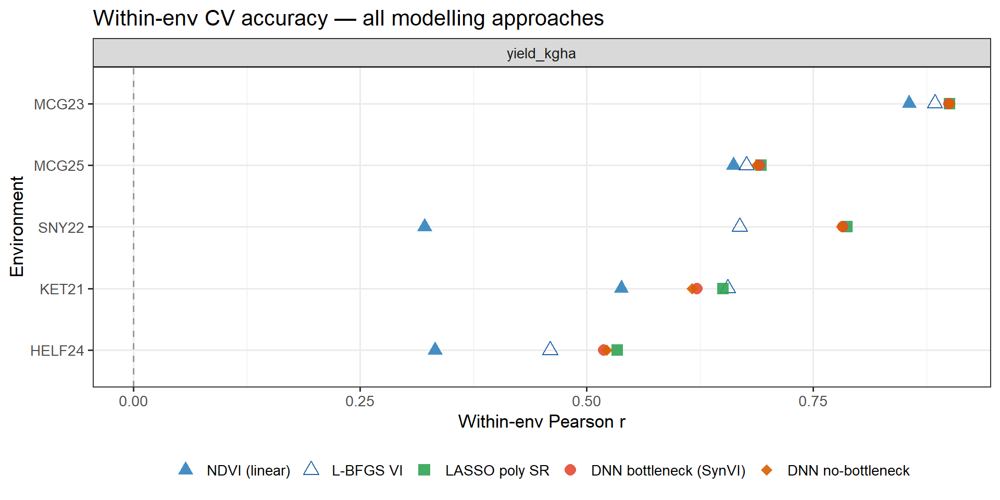

# Comparing Spectral VI Derivation Approaches for Barley Yield Prediction

[](LICENSE)
[](https://www.r-project.org/)
[](https://torch.mlverse.org/)
[](https://sss9010.github.io/dnn-synthetic-vi/DNN_Synthetic_VI.html)

Three approaches for deriving spectral vegetation indices from UAV multispectral imagery are compared for predicting barley grain yield across five field environments — benchmarked under the same leave-one-environment-out (LOEO) and within-environment cross-validation designs.

📄 **[Read the full rendered report](https://sss9010.github.io/dnn-synthetic-vi/DNN_Synthetic_VI.html)**

---

**TLDR:**
Standard indices (NDVI, NDRE, …) use fixed, hand-crafted band ratios. This analysis
asks: can learning the band combination from data improve cross-environment prediction?

Three approaches are evaluated using five raw spectral bands (blue, green, red,
red-edge, NIR):

1. **L-BFGS-optimised VI** — retains the interpretable normalised-ratio structure of
   NDVI but learns band weights that directly maximise Pearson *r* with yield.
2. **Symbolic regression** — LASSO polynomial SR and PySR search for compact
   mathematical expressions without constraining the formula structure.
3. **DNN bottleneck (Synthetic VI)** — a neural network with a single-neuron
   bottleneck learns a non-linear, data-optimised index end-to-end.

**Key finding:** L-BFGS-VI achieves the best LOEO generalisation, outperforming NDVI,
both DNN variants, LASSO polynomial SR, and PySR. The DNN bottleneck overfits to
training environments — the mean-embedding proxy for unseen environments is a weak
substitute for a learned representation, and stronger regularization with bigger datasets would be needed
to close that gap.

---

## Key Results

<p align="center">
  
  <br><em>LOEO mean Pearson r — all models compared. L-BFGS-VI leads cross-environment generalisation.</em>
</p>

<p align="center">
  
  <br><em>Leave-One-Environment-Out accuracy per held-out trial site (dots = training reps)</em>
</p>

<p align="center">
  
  <br><em>Within-environment 5-fold CV — all models. DNN approaches are competitive within environments.</em>
</p>

<p align="center">
  
  <br><em>Gradient-based band importance — which spectral channels drive the DNN Synthetic VI</em>
</p>

---

## Approaches

### Approach 1 — L-BFGS Coefficient Optimisation

The normalised-ratio structure of NDVI is preserved but all five bands enter
both numerator and denominator with learnable weights, optimised by L-BFGS to
directly maximise Pearson *r* on training data. Coefficients are initialised at
the NDVI solution; OLS then calibrates the linear scale.

### Approach 2 — Symbolic Regression

- **LASSO polynomial SR** — degree-2 polynomial features (15 interaction terms)
  with LASSO regularisation; fixed structure, learned coefficients.
- **PySR** — evolutionary search over expression trees; discovers both formula
  structure and coefficients without constraints (requires Python + PySR).

### Approach 3 — DNN Bottleneck (Synthetic VI)

```
Band Encoder      5 bands → FC(16) → ReLU → dropout
                                  → FC(8)  → ReLU → dropout
                                  → FC(1)           ← Synthetic VI (linear)
                                       ↓
Prediction Head   [SynVI ‖ env_embed(4)] → FC(8) → ReLU → FC(1) → trait
```

- **Bottleneck** — single linear neuron forces all spectral information through
  one scalar, mirroring NDVI structure while allowing non-linear band combinations.
- **Environment embedding** — learned 4-d vector per trial shifts the VI→trait
  mapping so the shared encoder can generalise across sites.
- **Full DNN** variant (no bottleneck) serves as an upper-bound reference.
- **LOEO inference** — mean embedding of the four training environments is used
  as a proxy for unseen environments; no fine-tuning required.

---

## Cross-Validation Schemes

| Scheme | Description |
|--------|-------------|
| **LOEO** (Leave-One-Environment-Out) | Train on 4 trial sites, predict the held-out 5th. Measures cross-environment generalisation. |
| **Within-env 5-fold by GID** | 5-fold CV within each environment, splits by genotype ID. Measures within-trial predictive ability for unseen lines. |
| **Adapt B — freeze encoder, fine-tune head** | Pre-train on 4 envs; freeze encoder; fine-tune prediction head + embedding on adaptation GIDs. |
| **Adapt C — SynVI + linear** | Pre-train on 4 envs; freeze encoder; fit OLS (trait ~ SynVI) on adaptation GIDs. No further neural network training. |

All schemes use **3 random-seed repetitions**. NDVI linear regression runs under
the same designs as a baseline. Splits are always by GID to prevent data leakage.

---

## Repository Structure

```
dnn_synthetic_vi/
├── analysis/
│   ├── DNN_Synthetic_VI.Rmd        # Main analysis — render this
│   └── DNN_Synthetic_VI_cache/     # knitr cache for heavy training chunks
├── data/
│   └── WMB_pheno.Rdata             # Input: merged spectral + phenotype table
├── docs/
│   ├── DNN_Synthetic_VI.html       # Pre-rendered HTML report
│   └── figure/DNN_Synthetic_VI.Rmd/  # All generated figures (PNG)
└── scripts/
    ├── ndvi_corr.R                 # NDVI–yield Pearson r per environment
    └── variance_partition.R        # Between- vs within-env variance decomposition
```

---

## Data

`data/WMB_pheno.Rdata` — a single R data frame containing:

| Column group | Contents |
|---|---|
| Spectral bands | `blue`, `green`, `red`, `red_edge`, `nir` (UAV reflectance per plot) |
| Standard VIs | NDVI, NDRE, EVI, GNDVI, SAVI, and more |
| Target trait | Yield and associated agronomic measurements (column 19) |
| Metadata | `GID` (genotype), `Env` (trial site), `Timepoint` |

**Five Env × Timepoint groups** are used — one optimal flight per trial year:
`HELF24_TP7`, `KET21_TP4`, `MCG23_TP5`, `MCG25_TP12`, `SNY22_TP6`


---

## Requirements

```r
install.packages(c(
  "tidyverse", "ggplot2", "patchwork",
  "corrplot", "knitr", "kableExtra",
  "torch", "glmnet", "reticulate"
))
torch::install_torch()          # one-time LibTorch download (~0.5 GB)
# reticulate::py_install("pysr") # optional — needed for PySR only
```

---

## Rendering the Report

Open R from the **project root** and run:

```r
rmarkdown::render("analysis/DNN_Synthetic_VI.Rmd",
                  output_dir = "docs",
                  output_file = "DNN_Synthetic_VI.html")
```

The knitr cache skips heavy training chunks (`run-training`, `run-adaptation-cv`,
`run-fulldnn-training`, `run-lasso-sr`, `run-lbfgs`) if code is unchanged.
Delete `analysis/DNN_Synthetic_VI_cache/` to force a full re-run (~hours on CPU).

---

## Helper Scripts

```r
source("scripts/ndvi_corr.R")               # NDVI–yield Pearson r per environment
source("scripts/variance_partition.R")      # eta² variance decomposition
source("analysis/extract_results.R")        # load and print results from knitr cache
source("analysis/quick_model_comparison.R") # fast LOEO preview (150 epochs, 1 rep)
```

---

## Citation

```
Sepp, S.S., Jannink, JL., Sorrells, M.E. (2025). Comparing Spectral VI Derivation Approaches for Barley Yield Prediction.
GitHub. https://github.com/sss9010/dnn-synthetic-vi
```

A machine-readable citation is in [`CITATION.cff`](CITATION.cff).

---

## Part of a larger project

This repository is a self-contained extract from the full NY Winter Malting Barley
prediction pipeline:  
🔗 **[sss9010/Predicting_WMB_for_NY](https://github.com/sss9010/Predicting_WMB_for_NY)**

---

## Contact

**Siim Sepp** — sss322@cornell.edu  

